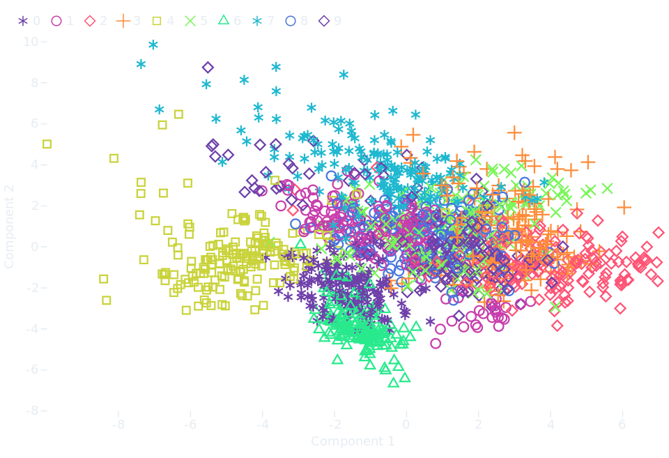

[](https://github.com/bourbonut/plotynium/actions/workflows/pages/pages-build-deployment)
[](https://github.com/astral-sh/ruff)

# Plotynium

Plotynium is a *Data Visualization* framework for Python, inspired by  [Observable Plot](https://observablehq.com/plot/).

## Installation

```bash
pip install git+https://github.com/bourbonut/plotynium
```

It will be available soon on Pypi.

## Example

```py
import polars as pl
from sklearn.datasets import load_digits
from sklearn.decomposition import PCA
from sklearn.preprocessing import StandardScaler

import plotynium as ply

mnist = load_digits()
scaler = StandardScaler()
X_scaled = scaler.fit_transform(mnist.data)
pca = PCA(n_components=2)
components = pca.fit_transform(X_scaled)

# Prepare your data with Polars, Pandas or manually
df = pl.DataFrame(components, schema=["Component 1", "Component 2"])
df = df.insert_column(2, pl.Series("digit", mnist.target))

plot = ply.plot(
    marks=[
        ply.dot(
            df.to_dicts(),
            x="Component 1",
            y="Component 2",
            stroke="digit",
            symbol="digit",
        )
    ],
    color={"scheme": ply.Interpolation.RAINBOW},
    symbol={"legend": True},
    style={"background": "#161b22", "color": "#e6edf3"},
)

with open("pca.svg", "w") as file:
    file.write(str(plot))
```

<p align="center">
    </img>
</p>
