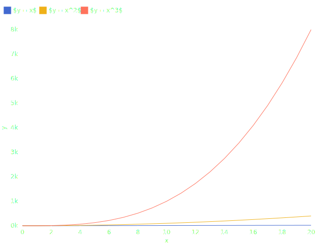
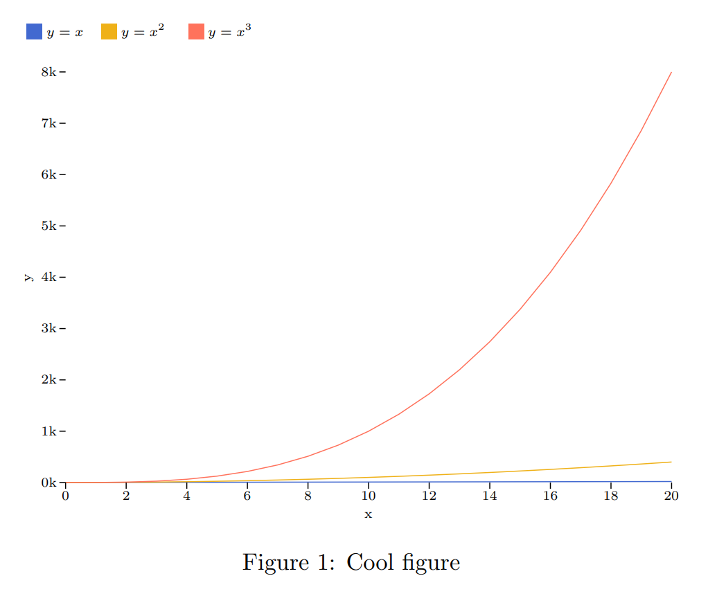

# Export with LaTeX

## Make SVG visualization

If you want math equations in LaTeX, or you just want to export your visualization to LaTeX, you should follow this tutorial.

Let's start with this simple code:

```python
import plotynium as ply

x = list(range(0, 21))
data = [
    {
        "x": xi,
        "y": pow(xi, i + 1),
        "label": (f"$y = x^{i + 1}$" if i > 0 else "$y = x$"),
    }
    for i in range(3)
    for xi in x
]

plot = ply.plot(
    marks=[ply.line(data, x="x", y="y", stroke="label")],
    color={"legend": True, "scheme": ply.Scheme.OBSERVABLE_10},
    y={"specifier": "~s"},
)

with open("figure.svg", "w") as file:
    file.write(str(plot))
```

**Expected output**



As you can see, labels contain `$` in order to make math equations through LaTeX.

## Convert and build your PDF

1. Convert the `figure.svg` to `figure.pdf_tex` with [`inkscape`](https://inkscape.org/).

    ```bash
    inkscape -D figure.svg -o figure.pdf --export-latex
    ```

2. Change the font size with the following command:

    ```bash
    sed -i 's/\\\f@size/ 7.5/g' figure.pdf_tex
    ```

3. Create a file `file.tex` and add the following content:

    ```latex
    \documentclass{article}
    \usepackage{color}
    \usepackage{graphicx}

    \begin{document}

    \begin{figure}[!ht]
      \centering
      \def\svgwidth{\columnwidth}
      \scalebox{0.8}{\input{figure.pdf_tex}}
      \caption{Cool figure}
    \end{figure}

    \end{document}
    ```

4. Compile the LaTeX file with `pdflatex`:

    ```bash
    pdflatex file.tex
    ```

5. Open `file.pdf`

    
