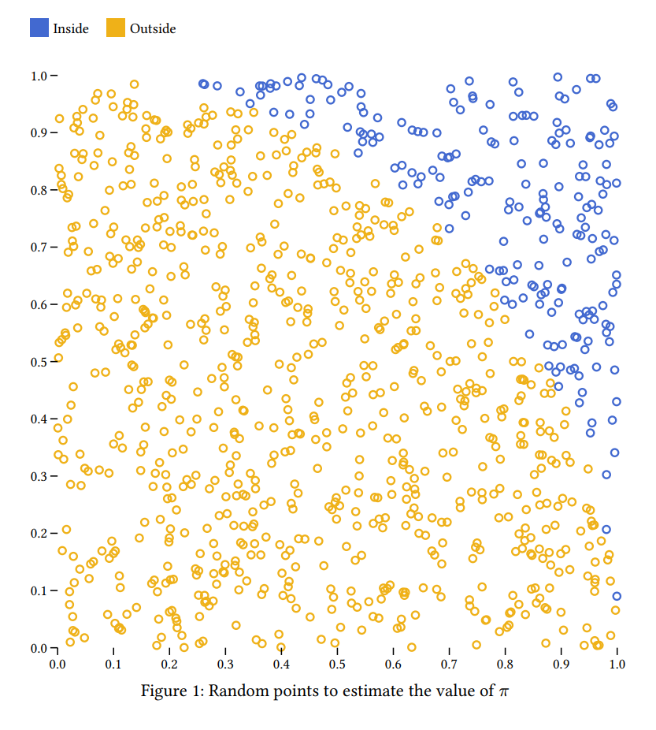

# Export with Typst

[Typst](https://typst.app/) supports SVG formats.

1. Make your SVG visualization

    ```bash
    python examples/pi_prob.py
    ```

    **Expected output**

    

2. Create a typst file `document.typ`

    ```typst
    #figure(
        image("pi.svg"),
        caption: [Random points to estimate the value of $pi$],
    )
    ```

3. Compile the document 

    ```bash
    typst compile document.typ
    ```

4. Open `document.pdf`

    
