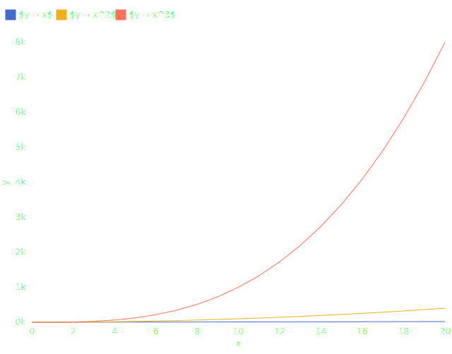

# Export your visualization

## Export with cairosvg

[`cairosvg`](https://cairosvg.org/) is a command-line interface for converting SVG to PNG, PDF, PS.

### Installation

```bash
pip install cairosvg
```

Check the [official website](https://cairosvg.org/) for more information.

### Usage

```console
$ cairosvg --help
usage: cairosvg [-h] [-v] [-f {eps,pdf,png,ps,svg}] [-d DPI] [-W WIDTH] [-H HEIGHT] [-s SCALE] [-b COLOR] [-n] [-i] [-u] [--output-width OUTPUT_WIDTH] [--output-height OUTPUT_HEIGHT] [-o OUTPUT] input

Convert SVG files to other formats

positional arguments:
  input                 input filename or URL

options:
  -h, --help            show this help message and exit
  -v, --version         show program's version number and exit
  -f {eps,pdf,png,ps,svg}, --format {eps,pdf,png,ps,svg}
                        output format
  -d DPI, --dpi DPI     ratio between 1 inch and 1 pixel
  -W WIDTH, --width WIDTH
                        width of the parent container in pixels
  -H HEIGHT, --height HEIGHT
                        height of the parent container in pixels
  -s SCALE, --scale SCALE
                        output scaling factor
  -b COLOR, --background COLOR
                        output background color
  -n, --negate-colors   replace every vector color with its complement
  -i, --invert-images   replace every raster pixel with its complementary color
  -u, --unsafe          resolve XML entities and allow very large files (WARNING: vulnerable to XXE attacks and various DoS)
  --output-width OUTPUT_WIDTH
                        desired output width in pixels
  --output-height OUTPUT_HEIGHT
                        desired output height in pixels
  -o OUTPUT, --output OUTPUT
                        output filename
```

For instance, after running the example `examples/pca.py`, you can convert the SVG to PNG with `cairosvg`:

```bash
python examples/pca.py && cairosvg pca.svg -o pca.png
```

## Export to Typst

[Typst](https://typst.app/) supports SVG formats.

1. Make your SVG visualization

```bash
python examples/pi_prob.py
```

2. Create a typst file `document.typ`

```typst
#figure(
    image("pi.svg"),
    caption: [Random points to estimate the value of $pi$],
)
```

3. Compile the document 

```bash
typst compile document.typ
```

## Export to LaTeX

### Make SVG visualization

If you want math equations in LaTeX, or you just want to export your visualization to LaTeX, you should follow this tutorial.

Let's start with this simple code:

```python
import plotynium as ply

x = list(range(0, 21))
data = [
    {
        "x": xi,
        "y": pow(xi, i + 1),
        "label": (f"$y = x^{i + 1}$" if i > 0 else "$y = x$"),
    }
    for i in range(3)
    for xi in x
]

plot = ply.plot(
    marks=[ply.line(data, x="x", y="y", stroke="label")],
    color={"legend": True, "scheme": ply.Scheme.OBSERVABLE_10},
    y={"specifier": "~s"},
)

with open("figure.svg", "w") as file:
    file.write(str(plot))
```

**Expected output**



As you can see, labels contain `$` in order to make math equations through LaTeX.

### Convert and build your PDF

1. Convert the `figure.svg` to `figure.pdf_tex` with [`inkscape`](https://inkscape.org/).

```bash
inkscape -D figure.svg -o figure.pdf --export-latex
```

2. Change the font size with the following command:

```bash
sed -i 's/\\\f@size/ 7.5/g' figure.pdf_tex
```

3. Create a file `file.tex` and add the following content:

```latex
\documentclass{article}
\usepackage{color}
\usepackage{graphicx}

\begin{document}

\begin{figure}[!ht]
  \centering
  \def\svgwidth{\columnwidth}
  \scalebox{0.8}{\input{figure.pdf_tex}}
  \caption{Cool figure}
\end{figure}

\end{document}
```

4. Compile the LaTeX file with `pdflatex`:

```bash
pdflatex file.tex
```

5. Open `file.pdf`


