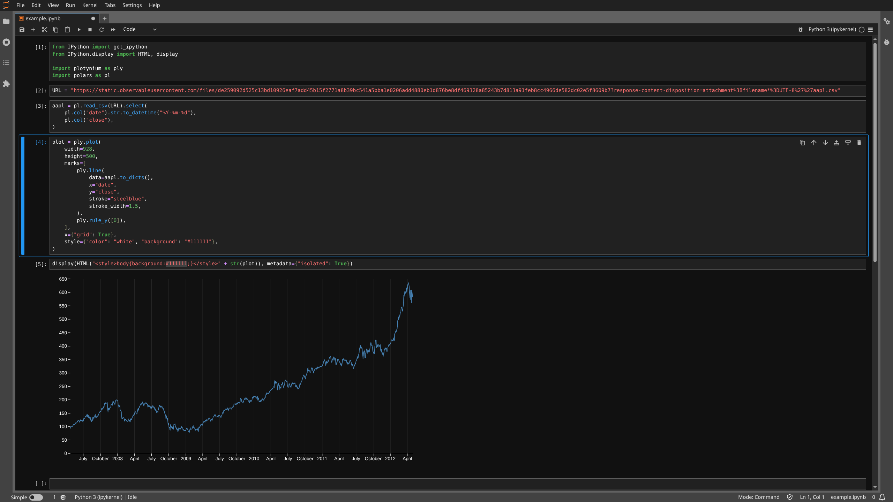

# Jupyter

The following steps help to visualize your SVG in [Jupyter](https://jupyter.org/).

1. Import `display` and `HTML` from `IPython.display`

    ```python
    from IPython.display import HTML, display
    ```

2. After building you SVG, add the following code in a new cell

    === "With default background color"

        ```python
        display(HTML(str(plot)), metadata={"isolated": True})
        ```

    === "With specific background color"

        ```python
        display(
            HTML("<style>body{background:#111111;}</style>" + str(plot)),
            metadata={"isolated": True}
        )
        ```


