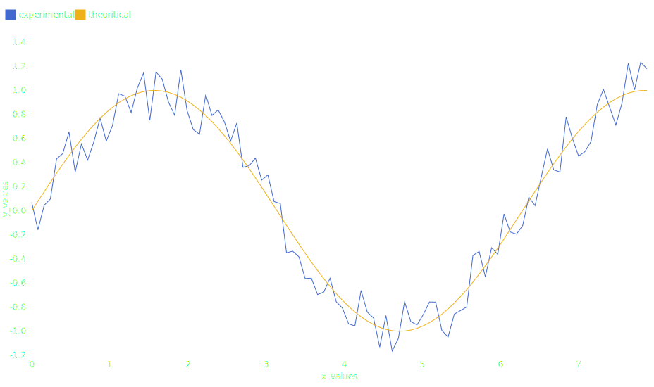

# Legend

There are two types of legend:

- **discrete legend** when there are several classes of data based on their color values or on their symbol shapes
- **continuous legend** when there are a gradient of colors

## Discrite legend

```python hl_lines="11 20 33 36"
import plotynium as ply
from math import sin, pi
import random

random.seed(42)

data = [
    {
        "x_values": i / (4 * pi),
        "y_values": sin(i / (4 * pi)) + 0.5 * (random.random() - 0.5),
        "label": "experimental", # (1)!
    }
    for i in range(100)
]

data += [
    {
        "x_values": i / (4 * pi),
        "y_values": sin(i / (4 * pi)),
        "label": "theoritical" # (2)!
    }
    for i in range(100)
]

plot = ply.plot(
    width=928,
    height=500,
    marks=[
        ply.line(
            data,
            x="x_values",
            y="y_values",
            stroke="label", # (3)!
        ),
    ],
    color={"legend": True},
    style={"color": "white"},
)

with open("plot.svg", "w") as file:
    file.write(str(plot))
```

1. These values help to distinguish lines.
2. These values help to distinguish lines.
3. Stroke colors are chosen from the default colorscheme [`Scheme.OBSERVABLE_10`](../colorschemes/schemes.md).



!!! note

    You can also specify your own function for `stroke` (or `fill`). Try this:

    ```python
    plot = ply.plot(
        marks=[
            ply.line(
                ...,
                stroke=lambda d: "lightslategray" if d["label"] == "experimental" else "red",
            ),
        ],
        color={"legend": True, "labels": {0: "experimental", 1: "theoritical"}},
    )
    ```

## Continuous legend

```python
import polars as pl
import plotynium as ply

URL = (
    "https://static.observableusercontent.com/files/1734c862dd51ef67930fef3d"
    "cd19e8184bb65c405683f55a085f97ca01c233713a53062c251fe0a6d72f93863fd5f71"
    "4eadef3c9455b1b4f2ed90546cbc57b32?response-content-disposition=attachme"
    "nt%3Bfilename*%3DUTF-8%27%27gistemp.csv"
)

gistemp = pl.read_csv(URL).select(
    pl.col("Date").str.to_datetime("%Y-%m-%d"),
    pl.col("Anomaly"),
)

plot = ply.plot(
    marks=[
        ply.rule_y([0]),
        ply.dot(gistemp.to_dicts(), x="Date", y="Anomaly", stroke="Anomaly"),
    ],
    y={
        "grid": True,
        "specifier": "+f",
        "label": "Surface temperature anomaly (°C)"
    },
    color={
        "scheme": ply.Interpolation.RDBU,
        "legend": True,
    },
    margin_left=60,
)

with open("diverging.svg", "w") as file:
    file.write(str(plot))
```


