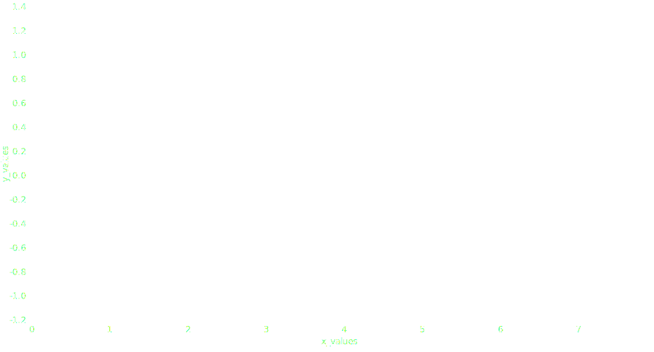

# Marks

You can draw multiple [marks](../marks/area.md) on the same plot.

```python hl_lines="18-22"
import plotynium as ply
from math import sin, pi
import random

random.seed(42)

data = [
    {
        "x_values": i / (4 * pi),
        "y_values": sin(i / (4 * pi)) + 0.5 * (random.random() - 0.5),
    }
    for i in range(100)
]

plot = ply.plot(
    width=928,
    height=500,
    marks=[
        ply.line(data, x="x_values", y="y_values"),
        ply.dot(data, x="x_values", y="y_values", fill="black"),
        ply.rule_y([0]),
    ],
)

with open("plot.svg", "w") as file:
    file.write(str(plot))
```


