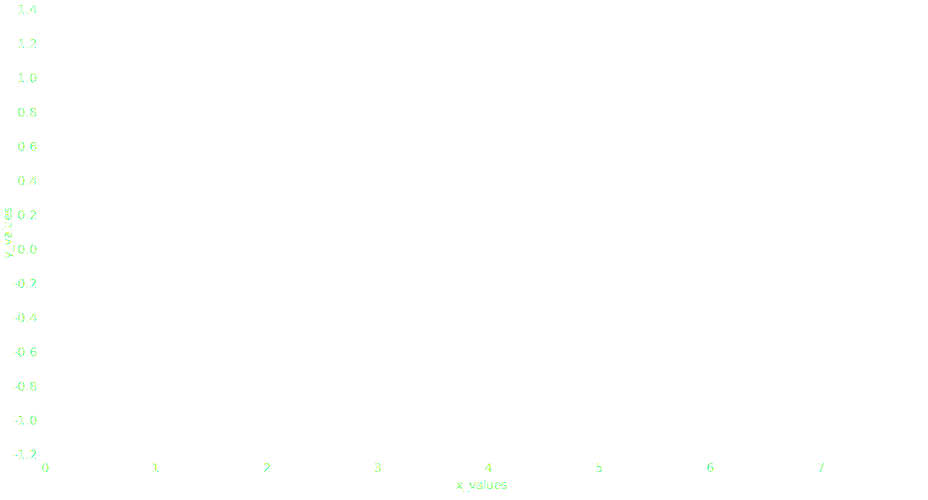

# Options

The function [`plot`](../api/plot.md) supports [options](../api/options.md) of X axis, Y axis, color legend, symbol legend, and style.
When an option has different fields, you can find its appropriate classes for each option to know what are its fields.
You can specify an option in two ways:

=== "From `dict`"

    ```python
    import plotynium as ply

    plot = ply.plot(
        marks=[...],
        y={
            "grid": True,
            "specifier": "+f",
            "label": "Surface temperature anomaly (°C)"
        },
    )
    ```

=== "With its appropriate class"

    ```python
    import plotynium as ply

    plot = ply.plot(
        marks=[...],
        y=ply.YOptions(
            grid=True,
            specifier="+f",
            label="Surface temperature anomaly (°C)",
        )
    )
    ```

## `grid` option

This option adds grid on X axis and Y axis.

```python hl_lines="19"
import plotynium as ply
from math import sin, pi
import random

random.seed(42)

data = [
    {
        "x_values": i / (4 * pi),
        "y_values": sin(i / (4 * pi)) + 0.5 * (random.random() - 0.5),
    }
    for i in range(100)
]

plot = ply.plot(
    width=928,
    height=500,
    marks=[ply.line(data, x="x_values", y="y_values")],
    grid=True,
)

with open("plot.svg", "w") as file:
    file.write(str(plot))
```



## `nice` option

This option makes axis ticks nicer.

```python hl_lines="19"
import plotynium as ply
from math import sin, pi
import random

random.seed(42)

data = [
    {
        "x_values": i / (4 * pi),
        "y_values": sin(i / (4 * pi)) + 0.5 * (random.random() - 0.5),
    }
    for i in range(100)
]

plot = ply.plot(
    width=928,
    height=500,
    marks=[ply.line(data, x="x_values", y="y_values")],
    x={"nice": True},
)

with open("plot.svg", "w") as file:
    file.write(str(plot))
```


!!! note

    By default, the option `nice` is `True` for Y axis.

## `style` option

This option is applied X axis, Y axis, legend and text.

```python hl_lines="20"
import plotynium as ply
from math import sin, pi
import random

random.seed(42)

data = [
    {
        "x_values": i / (4 * pi),
        "y_values": sin(i / (4 * pi)) + 0.5 * (random.random() - 0.5),
    }
    for i in range(100)
]

plot = ply.plot(
    width=928,
    height=500,
    margin_left=60,
    marks=[ply.line(data, x="x_values", y="y_values")],
    style={"color": "steelblue", "font_size": 15},
)

with open("plot.svg", "w") as file:
    file.write(str(plot))
```


