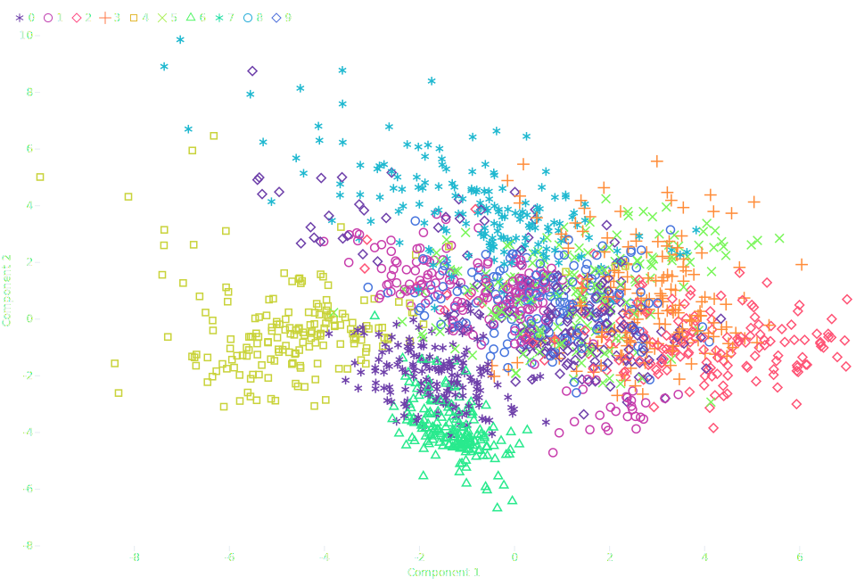

---
hide:
    - toc
    - navigation
---

# Welcome

Welcome to the [Plotynium](https://github.com/bourbonut/plotynium) framework documentation.

## What is Plotynium ?

Plotynium is a *Data Visualization* framework for Python, inspired by [Observable Plot](https://observablehq.com/plot/).

<div class="grid cards" markdown>

- :material-chart-bar: __Easy to use__

    ---

    Implements concise code to explore your data

- :octicons-package-dependencies-16: __Low dependencies__

    ---

    `plotynium` requires only `detroit` (<3MB) and `lxml` (<12MB) dependencies.

- :material-scale-balance: __Open Source__

    ---

    `plotynium` is licensed under MIT.

</div>

## Example

<figure markdown="span">
    
</figure>

```py
import polars as pl
from sklearn.datasets import load_digits
from sklearn.decomposition import PCA
from sklearn.preprocessing import StandardScaler

import plotynium as ply

mnist = load_digits()
scaler = StandardScaler()
X_scaled = scaler.fit_transform(mnist.data)
pca = PCA(n_components=2)
components = pca.fit_transform(X_scaled)

# Prepare your data with Polars, Pandas or manually
df = pl.DataFrame(components, schema=["Component 1", "Component 2"])
df = df.insert_column(2, pl.Series("digit", mnist.target))

plot = ply.plot(
    width=960,
    height=657,
    marks=[
        ply.dot(
            df.to_dicts(),
            x="Component 1",
            y="Component 2",
            stroke="digit", # (1)!
            symbol="digit", # (2)!
        )
    ],
    color={"scheme": ply.Interpolation.RAINBOW}, # (3)!
    symbol={"legend": True}, # (4)!
    style={"color": "#e6edf3"}, # (5)!
)

with open("pca.svg", "w") as file:
    file.write(str(plot))
```

1. Colors of points are chosen given its `digit` value
2. Symbols of points are chosen given its `digit` value
3. Check out the [colorscheme section](./colorschemes/interpolations.md) to see all available colorschemes.
4. It adds a legend of symbols (color included).
5. Style your plot as you want. Checkout [`StyleOptions`][plotynium.options.StyleOptions] for more option details.
