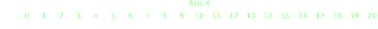

# Axis Mark

The [AxisX][plotynium.marks.AxisX] mark makes an X axis.



```python hl_lines="5-9"
import plotynium as ply

plot = ply.plot(
    [
        ply.axis_x(
            list(range(21)),
            anchor="top",
            label="Axis X",
        )
    ],
    margin_top=40
)

with open("axis_x.svg", "w") as file:
    file.write(str(plot))
```
The [AxisY][plotynium.marks.AxisX] mark makes an Y axis.


```python hl_lines="5-9"
import plotynium as ply

plot = ply.plot(
    [
        ply.axis_y(
            list(range(21)),
            anchor="right",
            label="Axis Y",
        )
    ],
    margin_right=60,
)

with open("axis_y.svg", "w") as file:
    file.write(str(plot))
```
