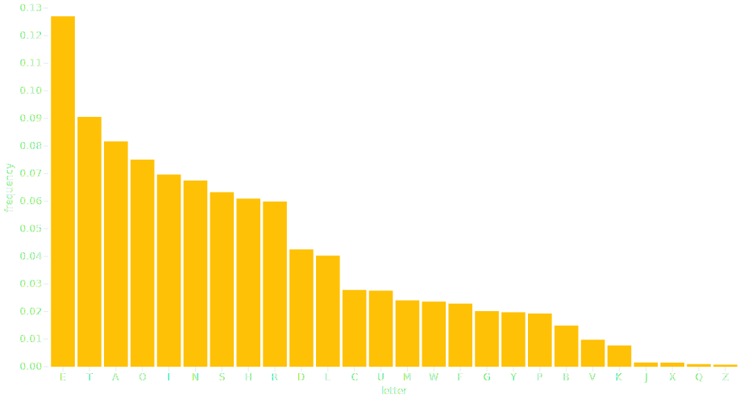

# Bar mark

The [BarY][plotynium.marks.BarY] mark draws vertical bar chart. A [SortOptions][plotynium.options.SortOptions] helps to order the data and has an impact on the scale domain.



```python hl_lines="19-25"
import plotynium as plot
from plotynium.options import SortOptions
import polars as pl

URL = (
    "https://static.observableusercontent.com/files/09f63bb9ff086fef80717e2e"
    "a8c974f918a996d2bfa3d8773d3ae12753942c002d0dfab833d7bee1e0c9cd358cd3578"
    "c1cd0f9435595e76901508adc3964bbdc?response-content-disposition=attachme"
    "nt%3Bfilename*%3DUTF-8%27%27alphabet.csv"
)

# Download data as dataframe
alphabet = pl.read_csv(URL) # columns = ['letter', 'frequency']

plot = plot.plot(
    width=928,
    height=500,
    marks=[
        plot.bar_y(
            data=alphabet.to_dicts(),
            x="letter",
            y="frequency",
            sort={"by": "frequency", "descending": True}, # (1)!
            fill="steelblue",
        )
    ],
    margin_left=60,
)

with open("bar.svg", "w") as file:
    file.write(str(plot))
```

1. This parameter follows [SortOptions][plotynium.options.SortOptions] API.

The [BarX][plotynium.marks.BarX] mark draws horizontal bar chart. A [SortOptions][plotynium.options.SortOptions] helps to order the data and has an impact on the scale domain.


```python hl_lines="19-25"
import plotynium as plot
from plotynium.options import SortOptions
import polars as pl

URL = (
    "https://static.observableusercontent.com/files/09f63bb9ff086fef80717e2e"
    "a8c974f918a996d2bfa3d8773d3ae12753942c002d0dfab833d7bee1e0c9cd358cd3578"
    "c1cd0f9435595e76901508adc3964bbdc?response-content-disposition=attachme"
    "nt%3Bfilename*%3DUTF-8%27%27alphabet.csv"
)

# Download data as dataframe
alphabet = pl.read_csv(URL) # columns = ['letter', 'frequency']

plot = plot.plot(
    width=928,
    height=500,
    marks=[
        ply.bar_x(
            data=alphabet.to_dicts(),
            x="frequency",
            y="letter",
            sort={"by": "frequency", "descending": True}, # (1)!
            fill="steelblue",
        )
    ],
    margin_left=60,
)

with open("bar.svg", "w") as file:
    file.write(str(plot))
```

1. This parameter follows [SortOptions][plotynium.options.SortOptions] API.
