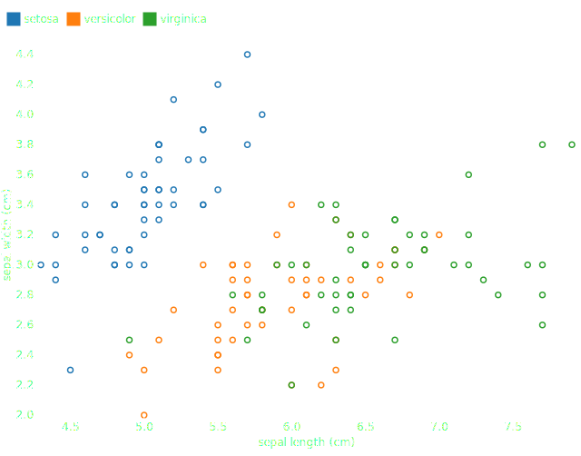

# Dot mark

The [Dot][plotynium.marks.Dot] mark draws two-dimensional points (as circles or symbols) for making a scatter chart. \(x\) scale and \(y\) scale are quantitive or temporal.



```py
import polars as pl
from sklearn.datasets import load_iris

import plotynium as ply

# Load data from scikit-learn and prepare them
iris = load_iris()
df = pl.DataFrame(iris.data, schema=iris.feature_names)
targets = pl.Series("species", iris.target)
uniques = targets.unique().sort().to_list()
names = iris.target_names
df = df.insert_column(
    df.width, targets.replace_strict(uniques, names, return_dtype=pl.String)
)

plot = ply.plot(
    marks=[
        ply.dot(
            df.to_dicts(),
            x="sepal length (cm)",
            y="sepal width (cm)",
            stroke="species",
        )
    ],
    color={"scheme": ply.Scheme.CATEGORY_10, "legend": True},
)

with open("dot.svg", "w") as file:
    file.write(str(plot))
```
