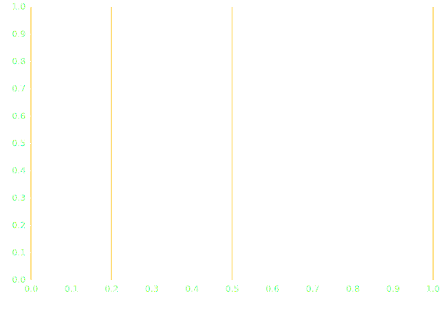
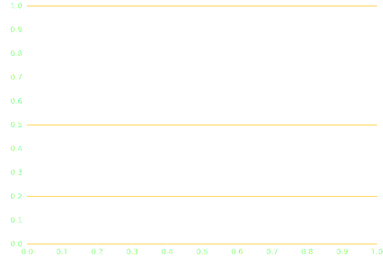

# Grid mark

The [GridX][plotynium.marks.GridX] mark adds vertical lines from x ticks.



```python hl_lines="5-9"
import plotynium as ply

plot = ply.plot(
    [
        ply.grid_x(
            [0, 0.2, 0.5, 1],
            stroke="#ffc105",
            stroke_opacity=1,
        )
    ],
    style={"color": "white"}
)

with open("grid_x.svg", "w") as file:
    file.write(str(plot))
```

The [GridY][plotynium.marks.GridX] mark adds horizontal lines from y ticks.



```python hl_lines="5-9"
import plotynium as ply

plot = ply.plot(
    [
        ply.grid_y(
            [0, 0.2, 0.5, 1],
            stroke="#ffc105",
            stroke_opacity=1,
        )
    ],
    style={"color": "white"}
)

with open("grid_y.svg", "w") as file:
    file.write(str(plot))
```
