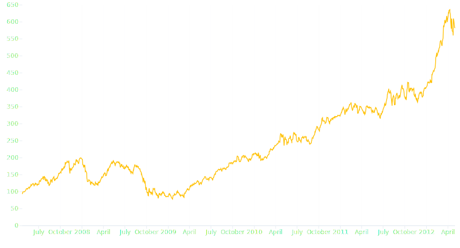

# Line mark

The [Line][plotynium.marks.Line] mark draws two-dimensional lines as in a line chart. \(x\) scale and \(y\) scale are quantitive or temporal.



```python hl_lines="21-27"
import plotynium as ply
import polars as pl

URL = (
    "https://static.observableusercontent.com/files/de259092d525c13bd10926ea"
    "f7add45b15f2771a8b39bc541a5bba1e0206add4880eb1d876be8df469328a85243b7d8"
    "13a91feb8cc4966de582dc02e5f8609b7?response-content-disposition=attachme"
    "nt%3Bfilename*%3DUTF-8%27%27aapl.csv"
)

# Download data and prepare them
aapl = pl.read_csv(URL).select( # columns = ['date', 'close']
    pl.col("date").str.to_datetime("%Y-%m-%d"),
    pl.col("close"),
)

plot = ply.plot(
    width=928,
    height=500,
    marks=[
        ply.line(
            data=aapl.to_dicts(),
            x="date",
            y="close",
            stroke="steelblue",
            stroke_width=1.5
        ),
        ply.rule_y([0]) # (1)!
    ],
    x={"grid": True},
)

with open("line.svg", "w") as file:
    file.write(str(plot))
```

1. Horizontal line on \(y = 0\)
