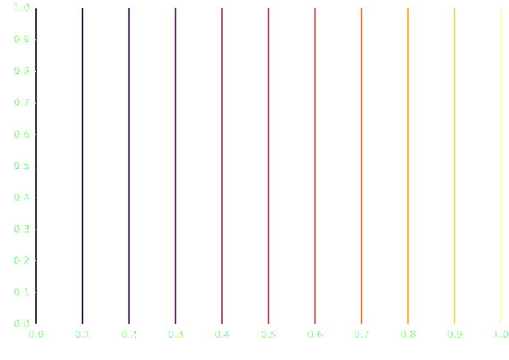
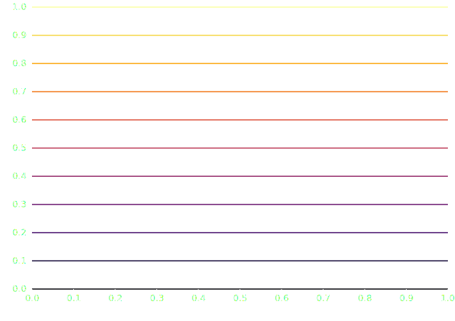

# Rule mark

The [RuleX][plotynium.marks.RuleX] mark draws vertical lines given a list of \(x\) positions.



```python hl_lines="5-8"
import plotynium as ply

plot = ply.plot(
    [
        ply.rule_x(
            [i / 10 for i in range(11)],
            stroke=lambda d: ply.Interpolation.INFERNO(d[0][0]), # (1)!
        ),
    ],
)

with open("rule_x.svg", "w") as file:
    file.write(str(plot))
```

1. The type of `d` is `tuple[tuple[float, float], tuple[float, float]]` which represents \(((x_0, y_0), (x_1, y_1))\) coordinates of one line. Also, `ply.Interpolation` accepts values between `0` and `1`.

The [RuleY][plotynium.marks.RuleY] mark draws horizontal lines given a list of \(y\) positions.



```python hl_lines="5-8"
import plotynium as ply

plot = ply.plot(
    [
        ply.rule_y(
            [i / 10 for i in range(11)],
            stroke=lambda d: ply.Interpolation.INFERNO(d[0][1]), # (1)!
        ),
    ],
)

with open("rule_y.svg", "w") as file:
    file.write(str(plot))
```

1. The type of `d` is `tuple[tuple[float, float], tuple[float, float]]` which represents \(((x_0, y_0), (x_1, y_1))\) coordinates of one line. Also. `ply.Interpolation` accepts values between `0` and `1`.
